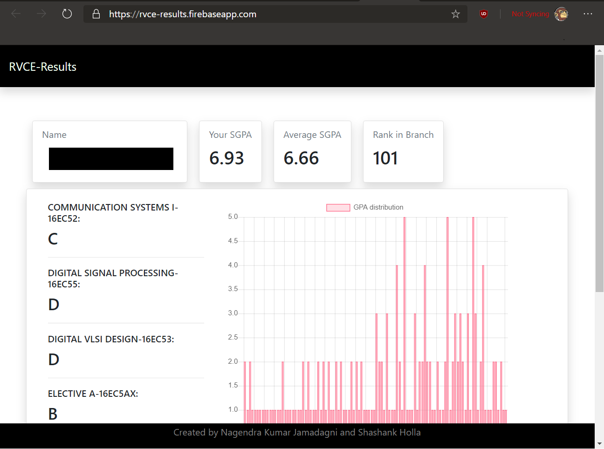

# RVCE-Results Scrapping
Live website at http://rvce-results.firebaseapp.com
____
## How its done

Data is scrapped from the RVCE Website using Selenium Webdriver for Java on the Geckodriver for Firebox. A CSV file is generated and uploaded to firebase's NoSQL type database.
Firebase is also the host for this webapp. 

The app is built like a single page app where the DOM in the same page is refreshed to load the results.

____
## Known Bugs

1. Rank in branch isnt accurate. 
2. Few branch results for Dec-2018 exams yet to be uploaded.

